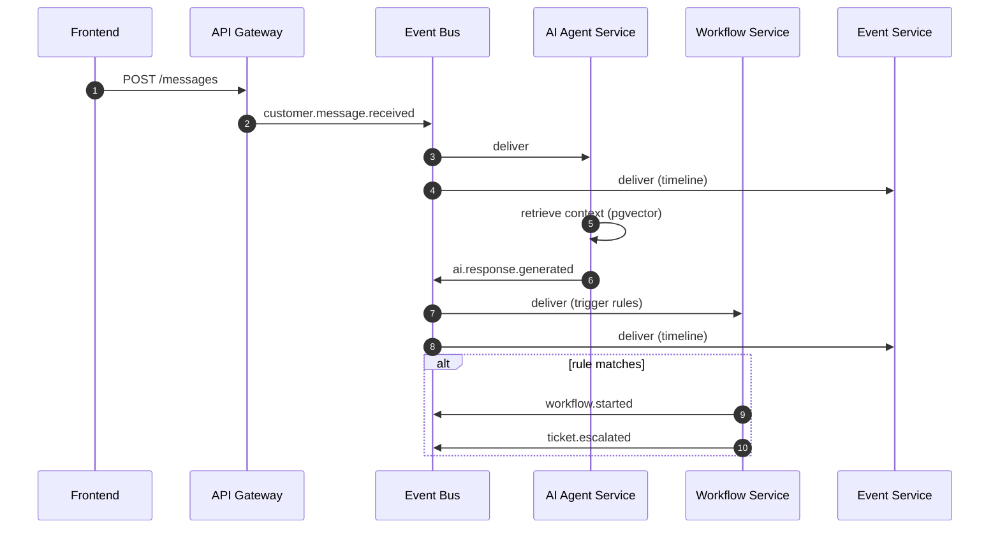

# Event Flow

This document describes the canonical event flow through the platform.
All events conform to `EventEnvelope` (see `@ai-ops/shared-types`).

## Event Catalog (Phase 1)

| Event Type                   | Publisher          | Consumers                          |
| ---------------------------- | ------------------ | ---------------------------------- |
| `customer.message.received`  | API Gateway        | AI Agent Service, Event Service    |
| `ai.response.generated`      | AI Agent Service   | Workflow Service, Analytics, Event |
| `ticket.escalated`           | Workflow Service   | Notification, Event Service        |
| `payment.failed`             | (external webhook) | Workflow, Notification, Event      |
| `workflow.started`           | Workflow Service   | Event, Analytics                   |
| `workflow.completed`         | Workflow Service   | Event, Analytics                   |
| `workflow.failed`            | Workflow Service   | Event, Notification, Analytics     |
| `tenant.rate_limit_exceeded` | API Gateway        | Notification, Analytics            |
| `tenant.created`             | Tenant Service     | All (provisioning fan-out)         |
| `user.invited`               | Tenant Service     | Notification                       |

## Example Flow: Customer Message → AI Response → Workflow

## Envelope Conventions

- `correlationId` is generated at the API Gateway and propagated through every
  downstream event using `causationId` to link parent → child.
- `schemaVersion` allows additive evolution of payloads without breaking consumers.
- All payloads must be JSON-serializable; binary blobs go to S3 with a reference.

## Retry & Dead-Letter

- Default retry policy: 5 attempts, exponential backoff (200ms × 2^n, max 30s).
- After max attempts, events route to a per-event-type DLQ stream.
- DLQ events are replayable via the Event Service admin API (Phase 4).
