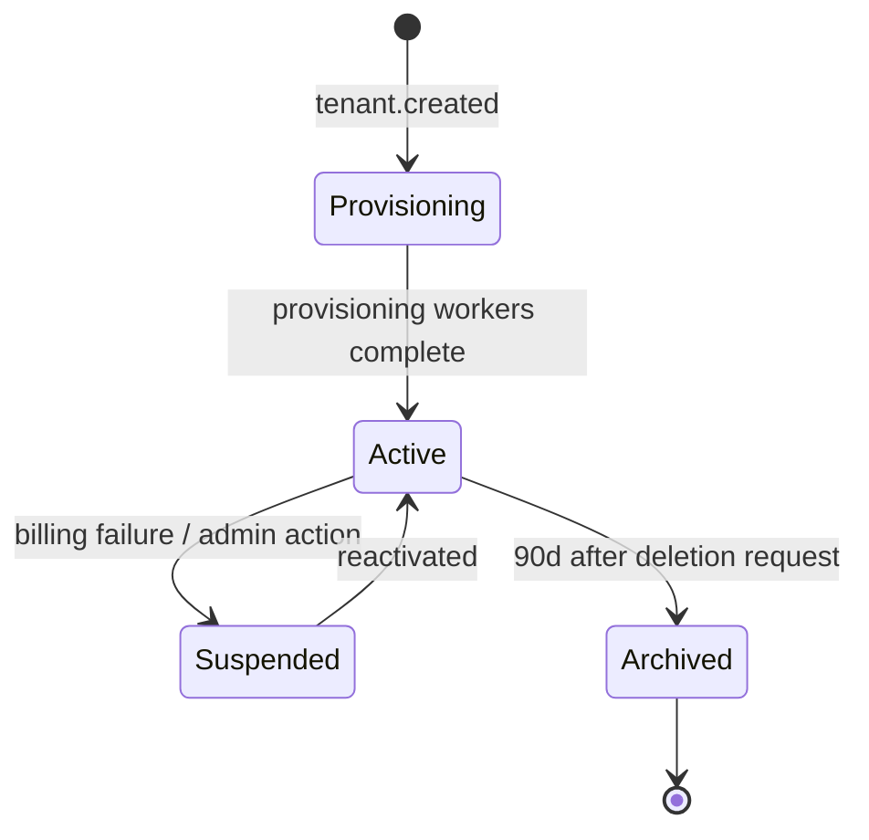

# Multi-Tenant Model

The platform is multi-tenant by default. Tenant isolation is enforced at
**every layer** — not just at the database.

## Layers of Isolation

### 1. Identity layer

- JWT carries a `tnt` (tenant) claim.
- A user can have memberships in multiple tenants but each token is bound to one.
- Switching tenants requires a fresh token issued by the Auth Service.

### 2. API layer

- All gateway routes pass through a `TenantContextMiddleware` that:
  - extracts `tenantId` from the JWT,
  - rejects mismatches between JWT `tenantId` and any path/body `tenantId`,
  - puts `tenantId` and `correlationId` into AsyncLocalStorage for downstream code.

### 3. Service layer

- Every Prisma query is wrapped in a `tenantScoped(prisma)` helper that injects
  `where: { tenantId }` into all reads/writes.
- A unit test enforces that no repository method exposes a non-tenant-scoped query.

### 4. Event layer

- `EventEnvelope.tenantId` is required and validated on publish.
- Consumers filter by `tenantId` before invoking handlers.
- Cross-tenant event delivery is a fatal error (logged + alerted).

### 5. AI / Vector layer

- pgvector queries always include `WHERE tenant_id = $1`.
- Vector indexes are partitioned per tenant for large tenants (Phase 5+).

### 6. Storage layer

- S3 keys are prefixed with `tenants/<tenantId>/...`.
- IAM policies (Phase 8) restrict service roles to their tenant key prefixes
  per request via session policies.

## Tenant Lifecycle

## Per-Tenant Configuration

Stored in `tenant_configs` table:

- Feature flags (e.g. `aiWorkflowsEnabled`).
- Plan limits (users, workflows, AI calls/month, events/min).
- Branding overrides.
- Webhook endpoints.

## Anti-Patterns to Avoid

- **Global default tenant**. There is no "default" tenant — operations without a
  tenant context are programming errors.
- **Joining across tenants**. Reports/analytics aggregate _within_ a tenant or use
  pre-aggregated, anonymized data in a separate schema.
- **Shared caches without tenant keys**. All Redis keys are prefixed with
  `t:<tenantId>:...`.
