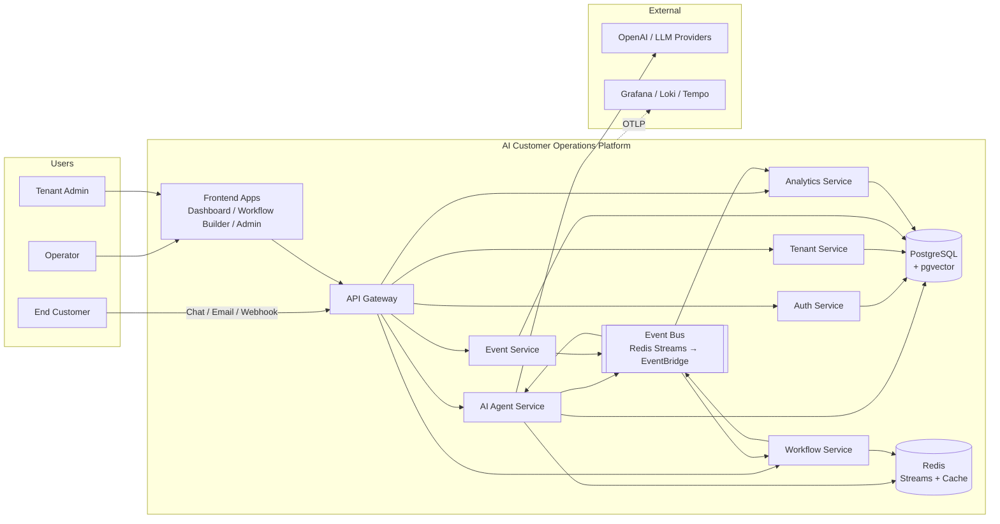

# System Context

High-level view of the AI Customer Operations Platform and its primary actors.

## Key Properties

- **Multi-tenant by default**: every API call and every event carries a `tenantId`.
- **Event-driven backbone**: services communicate via the event bus for async work;
  REST/GraphQL only for synchronous CRUD.
- **Tenant-aware AI**: agents retrieve only their tenant's vector embeddings.
- **Observability is end-to-end**: a `correlationId` flows from the browser through
  every service, every event, and every AI tool call.
